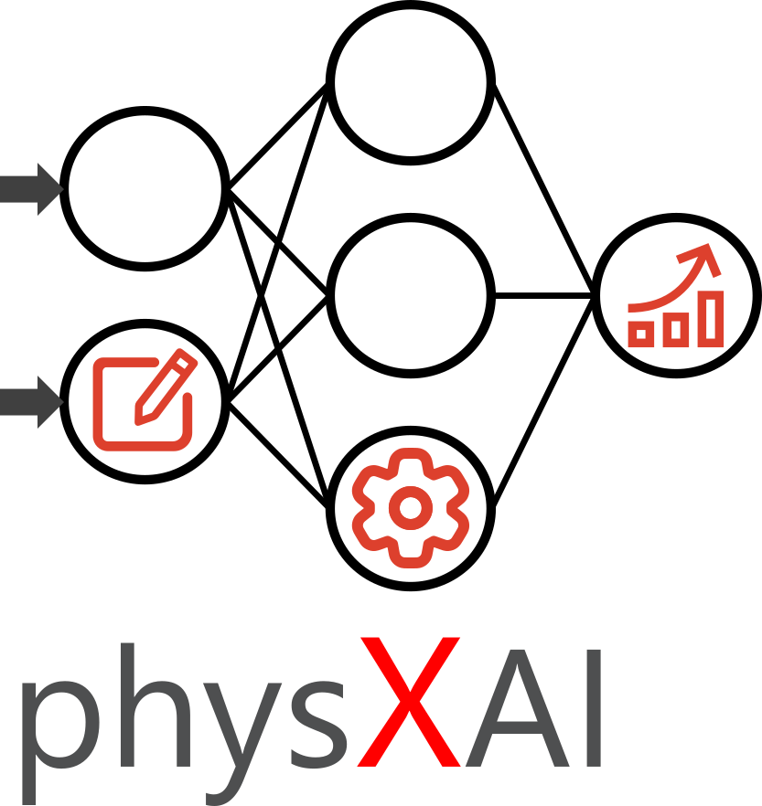

## About The Project
The physXAI Toolbox is designed for creating physics-guided models, also known as physics-informed or physics-constrained models. 
These models are specifically intended for application in Model Predictive Control (MPC) of Building Energy Systems (BES). 
The toolbox aims to integrate physical knowledge into machine learning models to improve their accuracy, robustness, and interpretability for energy system optimization.

## Installation
Create conda environment with Python 3.12 and install requirements with pip:
```
conda create -n <name_of_environment> python=3.12 pip
conda activate <name_of_environment>
cd <path_to_repository>
pip install -r requirements.txt
```

## Getting Started
Executable and commented examples demonstrating the use of the physXAI Toolbox can be found in the `executables` directory. 
These examples serve as a starting point for new projects and showcase how to configure and run the models.
New executable scripts should be added to the `executables` directory.

## Current Model Types
The physXAI currently focuses on physics-guided neural networks build with Keras and Tensorflow.
Models in this repository are categorized into two main types:
- Single-Step Models: Predicting one step ahead. Can be used recursivly in the MPC.
	- Linear Regression (sicit-learn)
	- Classical ANN
	- Radial Basis Function Network (RBF): RBF Models extrapolate to 0. Useful for residual models.
	- Residual Model: hybrid model combining a Linear Regression model with an RBF, that models the residuals of the linear regression.
	- Constrained Monotonic Neural Network (CMNN): Allows enforcing monotonicity constraints on input features.
	- Physics-Informed Neural Network (PINN): Allows to add physics-informed loss functions
- Multi-Step Models: Predictiing a trajectory.
	- Recurrent Neural Network: Currently allow SimpleRNN, GRU and LSTM.

## Project Structure
The project is organized into the following directories:
- `executables`: Contains executable scripts and configuration files. This is the primary location for users to run and test models.
- `data`: Storage for input data, typically in `.csv` format. Datasets required for training and evaluating models should be placed here.
- `stored_data`: This directory is used to save trained models, model parameters, and any relevant metadata generated during the modeling process.
- `core_functions`: Contains the core logic and main functionalities of the physXAI Toolbox.
	- `preprocessing`: Modules and scripts for data preprocessing tasks (e.g., cleaning, normalization, feature engineering).
	- `models`: Modules related to model creation and definition.
		- `models.py`: Contains base model architectures and generic model components.
		- `ann`: Specific components, layers, or utilities tailored for Artificial Neural Network (ANN) based models.
	- `plotting`: Scripts and functions for generating plots and visualizations of data, model results, etc.
	- `evaluation`: Modules for evaluating model performance using various metrics.
	- `utils`: Utility functions and helper scripts used across different parts of the toolbox.
- `docs`: Contains documentation for the project.
- `Archive`: Used for archiving older versions of the code, data, or models to keep the main project structure clean.

## Acknowledgments

We gratefully acknowledge the financial support by Federal Ministry for Economic Affairs and Climate Action (BMWK), promotional reference 03EN6022B.


## Contact
Patrick Henkel
patrick.henkel@eonerc.rwth-aachen.de